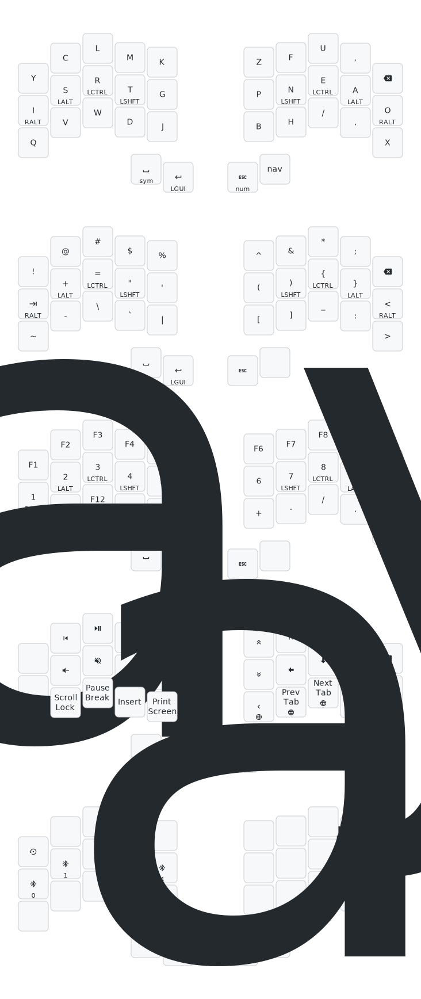

Firmware for: [Urchin Keyboard](https://github.com/duckyb/urchin)

## Getting started

[Download the firmware zip from the latest action run.](https://github.com/ToppDev/zmk-config/actions/workflows/build.yml?query=is%3Asuccess+branch%3Amain) Check [the ZMK docs](https://zmk.dev/docs/user-setup#installing-the-firmware) for instructions on how to flash it.

## Keymap Cheat Sheet

  

*This diagram was created using [caksoylar/keymap-drawer](https://github.com/caksoylar/keymap-drawer)*
